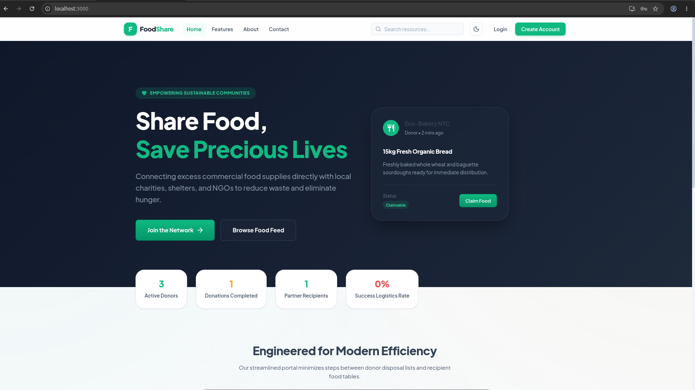

# Food Distribution Platform

A comprehensive web application that connects food donors (restaurants, bakeries, event caterers) with local NGOs, shelters, and individuals to schedule and fulfill food pickups, reducing waste and supporting communities in need.

##Preview 



## 🚀 Features

### ✅ **User Authentication & Management**

- **Secure Registration/Login** with email and password
- **Role-based Access Control**: Donor, Recipient, Admin
- **JWT Authentication** with refresh tokens
- **Profile Management** with personal information and preferences
- **Password Change** functionality

### ✅ **Donor Portal**

- **Create Donations** with comprehensive form including:
  - Food details (title, description, type, quantity, allergens)
  - Pickup scheduling with date/time pickers
  - Location management with address input
  - Additional instructions and tags
- **Dashboard** with donation statistics and management
- **Real-time status tracking** (available, claimed, picked-up, completed)
- **Donation history** and analytics

### ✅ **Recipient Dashboard**

- **Browse Available Donations** sorted by proximity and relevance
- **Advanced Search & Filtering** by location, food type, and availability
- **Claim Donations** for pickup
- **Personal Dashboard** with claimed donations and statistics
- **Location-based recommendations**

### ✅ **Admin Panel**

- **User Management** with role assignment and status control
- **Donation Oversight** with approval and moderation tools
- **Analytics Dashboard** with platform statistics
- **System Settings** for email/SMS configuration
- **Real-time monitoring** of platform activity

### ✅ **Real-Time Features**

- **Email Notifications** for new posts, claims, and updates
- **SMS Notifications** via Twilio integration
- **Real-time Updates** using Socket.io
- **Live Status Changes** across the platform

### ✅ **Advanced Features**

- **Geospatial Queries** for location-based matching
- **Responsive Design** optimized for all devices
- **Form Validation** with comprehensive error handling
- **Image Upload** support for donation photos
- **Search & Filter** functionality
- **Export & Reporting** capabilities

## 🛠 Tech Stack

### **Frontend**

- **React 19.1.1** with modern functional hooks and Context API
- **Tailwind CSS v3.4.15** for utility-first layout design and glassmorphic dashboards
- **Framer Motion** for premium interactive animations and state transitions
- **Material-UI (MUI) v5/v6** for specialized theme baseline and pickers
- **React Router DOM v6** with secure Route Guard layers
- **Axios v1.11.0** for HTTP communication and automatic token refresh interceptors
- **Date-fns v2.30.0** for date format parsing
- **@mui/x-date-pickers** for pickup scheduling

### **Backend**

- **Node.js** with Express 4.18.2
- **MongoDB** with Mongoose 7.5.0 for data modeling
- **JWT** (jsonwebtoken 9.0.2) for authentication
- **bcryptjs 2.4.3** for password hashing
- **CORS 2.8.5** for cross-origin requests
- **dotenv 16.3.1** for environment management

### **Services & Utilities**

- **Nodemailer 6.9.4** for email notifications
- **Twilio 4.15.0** for SMS notifications
- **Multer 1.4.5-lts.1** for file uploads
- **Express-rate-limit 6.10.0** for API protection
- **Helmet 7.0.0** for security headers
- **Express-validator 7.0.1** for input validation
- **Node-geocoder 4.2.0** for geocoding
- **Socket.io 4.7.2** for real-time communication

### **Development Tools**

- **Nodemon 3.0.1** for server development
- **Concurrently 8.2.0** for running multiple processes
- **ESLint** for code quality

## 📋 Prerequisites

- **Node.js** (v16 or higher)
- **MongoDB** (local or Atlas)
- **Twilio account** (for SMS notifications - optional)
- **Google Maps API key** (for geocoding - optional)

## 🚀 Quick Start

1. **Clone the repository**

   ```bash
   git clone https://github.com/ankesh15/Food-Distribution-Platform
   cd "Food ditribution platform"
   ```

2. **Install dependencies**

   ```bash
   npm run install-all
   ```

3. **Environment Setup**
   Create a `.env` file in the root directory:

   ```env
   # Server Configuration
   PORT=5000
   NODE_ENV=development

   # MongoDB
   MONGODB_URI=your_mongodb_connection_string

   # JWT
   JWT_SECRET=your_jwt_secret_key
   JWT_REFRESH_SECRET=your_refresh_secret_key

   # Email (Nodemailer) - Optional
   EMAIL_HOST=smtp.gmail.com
   EMAIL_PORT=587
   EMAIL_USER=your_email@gmail.com
   EMAIL_PASS=your_app_password

   # Twilio - Optional
   TWILIO_ACCOUNT_SID=your_twilio_sid
   TWILIO_AUTH_TOKEN=your_twilio_token
   TWILIO_PHONE_NUMBER=your_twilio_phone

   # Google Maps - Optional
   GOOGLE_MAPS_API_KEY=your_google_maps_api_key
   ```

4. **Start development servers**

   ```bash
   npm run dev
   ```

5. **Access the application**
   - **Frontend**: http://localhost:3000
   - **Backend API**: http://localhost:5000

## 📁 Project Structure

```
Food ditribution platform/
├── client/                    # React frontend
│   ├── public/               # Static assets
│   ├── src/
│   │   ├── components/       # Reusable components
│   │   │   └── Navbar.js     # Navigation component
│   │   ├── context/          # React context
│   │   │   └── AuthContext.js # Authentication context
│   │   ├── pages/            # Page components
│   │   │   ├── AdminPanel.js # Admin dashboard
│   │   │   ├── CreateDonation.js # Donation creation form
│   │   │   ├── Dashboard.js  # User dashboard
│   │   │   ├── Donations.js  # Donations listing
│   │   │   ├── Home.js       # Landing page
│   │   │   ├── Login.js      # Login page
│   │   │   ├── Profile.js    # Profile management
│   │   │   └── Register.js   # Registration page
│   │   ├── App.js            # Main app component
│   │   └── index.js          # App entry point
│   ├── package.json          # Frontend dependencies
│   └── README.md             # Frontend documentation
├── server/                    # Node.js backend
│   ├── middleware/           # Custom middleware
│   │   └── auth.js           # Authentication middleware
│   ├── models/               # MongoDB models
│   │   ├── Donation.js       # Donation schema
│   │   └── User.js           # User schema
│   ├── routes/               # API routes
│   │   ├── admin.js          # Admin routes
│   │   ├── auth.js           # Authentication routes
│   │   ├── donations.js      # Donation routes
│   │   └── users.js          # User routes
│   ├── services/             # Business logic
│   │   ├── emailService.js   # Email notifications
│   │   └── smsService.js     # SMS notifications
│   ├── utils/                # Utility functions
│   │   └── geocoder.js       # Geocoding utilities
│   ├── test/                 # Test files
│   │   └── test.js           # Test configuration
│   └── index.js              # Server entry point
├── package.json              # Backend dependencies
└── README.md                 # Project documentation
```

## 🔧 API Endpoints

### **Authentication**

- `POST /api/auth/register` - User registration
- `POST /api/auth/login` - User login
- `POST /api/auth/refresh` - Refresh JWT token
- `POST /api/auth/logout` - User logout
- `GET /api/auth/me` - Get current user profile

### **Donations**

- `GET /api/donations` - Get all donations (with filters)
- `POST /api/donations` - Create new donation
- `GET /api/donations/:id` - Get specific donation
- `PUT /api/donations/:id` - Update donation
- `DELETE /api/donations/:id` - Delete donation
- `POST /api/donations/:id/claim` - Claim donation

### **Users**

- `GET /api/users/profile` - Get user profile
- `PUT /api/users/profile` - Update user profile
- `GET /api/users/donations` - Get user's donations
- `GET /api/users/claims` - Get user's claimed donations

### **Admin**

- `GET /api/admin/users` - Get all users (admin only)
- `GET /api/admin/donations` - Get all donations (admin only)
- `PUT /api/admin/users/:id` - Update user status (admin only)
- `DELETE /api/admin/donations/:id` - Delete donation (admin only)

## 🎯 Key Features Implemented

### **Routing & Session Redirection**

- **Automatic Portal Transitions**: Logged-in users are automatically redirected from marketing paths (`/`, `/login`, `/register`) to `/dashboard`.
- **Layout Guards (`LayoutWrapper`)**: Conditionally serves the premium `DashboardLayout` for authenticated views, and the clean public layout for guest views.
- **Anchor Section Linkage**: Fully supports direct scrolling to home sections (`#features`, `#about`, `#contact`) from anywhere in the application.
- **Robust Route Guarding**: Unauthenticated users are prevented from visiting protected portals (e.g. `/dashboard`, `/analytics`, `/requests`).

### **Modern Responsive Design**

- **Tailwind Sticky Top Navbar**: A unified glassmorphism-based top navigation replaces legacy side navigation, maximizing dashboard screen space.
- **Active Navigation Highlighting**: High-contrast, dynamic Tailwind CSS styling indicates current location paths.
- **Mobile First Adaptation**: Fully interactive mobile hamburger menus with a sleek animated drawer.

### **Dashboard Functionality**

- **Personalized Welcome** with user-specific content
- **Statistics Cards** showing donation metrics
- **Quick Action Buttons** for common tasks
- **Recent Activity** sections
- **Role-based Content** (different for donors vs recipients)

### **Create Donation Form**

- **Comprehensive Form** with all necessary fields
- **Date/Time Pickers** for pickup scheduling
- **Location Management** with address input
- **Form Validation** with error handling
- **Image Upload** support
- **Tags and Categories** for better organization

### **Profile Management**

- **Personal Information** editing
- **Password Change** functionality
- **Notification Preferences** (email/SMS)
- **Account Settings** and preferences
- **Member Since** and last login tracking

### **Admin Panel**

- **User Management** with role assignment
- **Donation Oversight** with approval tools
- **Analytics Dashboard** with platform statistics
- **System Settings** for configuration
- **Real-time Monitoring** capabilities

## 🚀 Available Scripts

- `npm run dev` - Start both frontend and backend in development mode
- `npm run server` - Start only the backend server
- `npm run client` - Start only the frontend development server
- `npm run build` - Build the frontend for production
- `npm run start` - Start the production server
- `npm run install-all` - Install dependencies for both frontend and backend

## 🤝 Contributing

1. Fork the repository
2. Create a feature branch (`git checkout -b feature/amazing-feature`)
3. Commit your changes (`git commit -m 'Add amazing feature'`)
4. Push to the branch (`git push origin feature/amazing-feature`)
5. Open a Pull Request

## 📄 License

This project is licensed under the MIT License - see the [LICENSE](LICENSE) file for details.

## 🙏 Acknowledgments

- **Material-UI** for the beautiful component library
- **React Community** for the excellent documentation and tools
- **MongoDB** for the flexible database solution
- **Node.js Community** for the robust ecosystem


